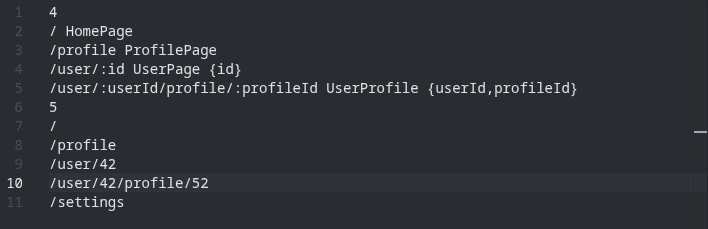
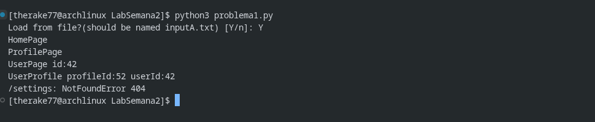
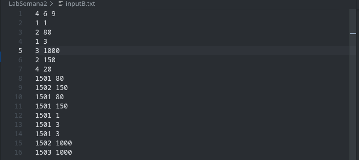
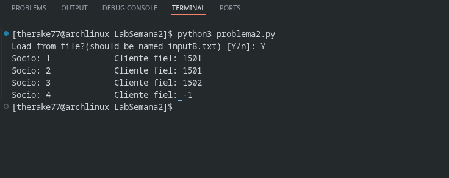

## Laboratorio 2
### Pregunta 1
#### Introducción
`problema1.py` resuelve rutas que consisten de la forma `\name1[\:param1]\name2[\:param2]...` a estados especificados con formato `stateName [{param1[,param2,...]}]`. Para ello, utiliza un enfoque basado en expresiones regulares para validar entradas (declaración de rutas y estados), así como también para resolver rutas dadas a estados.
#### Estructura
El programa a grandes rasgos está compuesto de  
- La clase `Route`:
- La clase `State`
- Dos funciones para ingresar datos (desde la terminal o un archivo)
- La función principal
```python
class Route: ...
class State: ...
def captureInputs() -> tuple[dict[str,str],list[str]] : ...
def readFromFile() -> tuple[dict[str,str],list[str]] : ...
...
```  
**`Route`**: Clase que representa una ruta literal. Consiste de dos métodos  
- `__init__`: Toma una ruta literal y realiza una serie de operaciones sobre ella:  
    - Primero divide la ruta en sus segmentos: las etiquetas separadas por el caracter `\`
    - Luego procede a construir una expresión regular que será guardada en la clase como sigue:
        - Si la etiqueta no comienza con `:` es simplemente una etiqueta más y se la agrega de forma literal a la expresión regular, además de guardarse el nombre del parámetro en la variable `Route.args`
        - Caso contrario es un parámetro a capturar, cuya expresión regular es `(?:P<name>[^\/])`
- `match`: Toma una cadena y la compara con la expresión regular de la clase:
    - Si coinciden, entonces se devuelve un diccionario que consiste en pares cuyas llaves son el nombre correspondiente de parámetro, y el valor capturado  
      
**`State`**: Clase que encapsula un estado y se encarga de su correcta interpretación. Sólo tiene como método su constructor:
- `__init__`: Toma un literal de forma `name {param1,...}`, guarda el nombre `name` como nombre del estado y almacena los nombres de los parámetros `param1,param2,...` en un conjunto. De no haber ninguno, el conjunto simplemente es vacío.
#### Flujo
El flujo del programa es el siguiente:
- Primero se le solicita al usuario si desea ingresar los datos a través de un archivo (cuyo nombre debe ser `inputA.txt`), o ingresarlos por consola.
    - Si ocurre un error en el ingreso de datos, el flujo se pausa hasta que se presione nuevamente una tecla
- Con los datos cargados, se procede a construir un mapa de rutas y estados (`routeMap = {Route:State}`).
    - En la construcción de cada par, se verifica que no exista errores. También es considerado un error si la lista de argumentos del objeto Ruta varía de la lista de argumentos de su Estado correspondiente
- Con la rudimentaria 'tabla de rutas' construida (`routeMap`), se procede a resolver las pruebas especificadas en la entrada:
    - Por cada ruta de prueba, se comprobará cada ruta con las rutas guardadas en la 'tabla de rutas'. Si con alguna de ellas coincide, se imprime la ruta, su estado y sus correspondientes argumentos, si los tiene.
    - Si la ruta no encaja con ninguna ruta en la tabla de rutas, entonces se imprime `NotFound 404`.
#### Demostración
Entrada:  


Salida:  


### Pregunta 2
#### Introducción
`problema2.py` permite conocer el cliente más 'fiel' de cada socio de un conjunto de socios dados, usando estructuras de datos simples como diccionarios y conjuntos
#### Estructura
El programa consta de dos funciones para capturar datos cuya lógica es idéntica, y la única variante es de dónde leen los datos (terminal o archivo de texto)
```python
def captureInputs()  -> tuple[dict[int, set[int]], dict[int, set[int]]]:...
def readFromFile() -> tuple[dict[int, set[int]], dict[int, set[int]]]:...
``` 
Ambas funciones retornan una tupla, que consta de:
- Un diccionario de valores `(socioID : listaTerminalID)`
- Un diccionario de valores `(terminalID : listaClientesDeTerminal)`

##### Flujo
El flujo del programa consiste en el siguiente:
- El programa solicita saber si la entrada será por un archivo o por la consola
- El programa captura los datos por el medio especificado
    - De haber un error, el programa vuelve a preguntar por datos desde 0 sin cambiar de canal seleccionado
- Con los datos , los cuales son dos diccionarios `ptMap` y `tcMap`, por cada socio en `ptMap`:
    - Creamos un diccionario para mantener los clientes del socio y las veces que aparecen en una terminal de éste (`clientCount`).
    - Por cada terminal del socio:
        - Por cada cliente que aparece en la terminal del socio, actualizamos `clientCount` (incrementamos o creamos un nuevo espacio en el diccionario)

##### Demostración
Entrada:  


Salida:  
